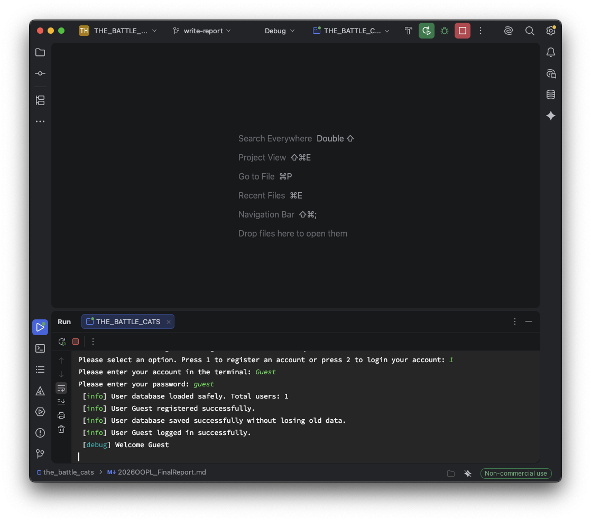
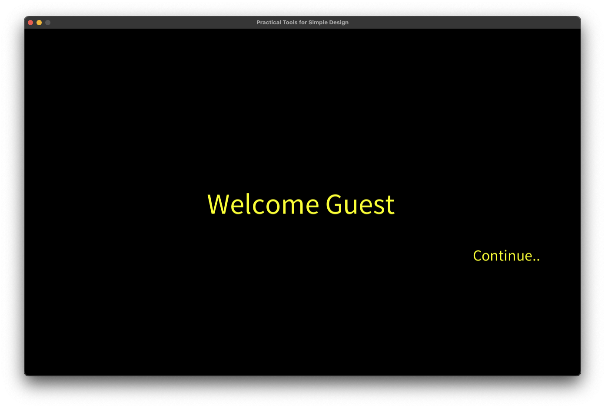
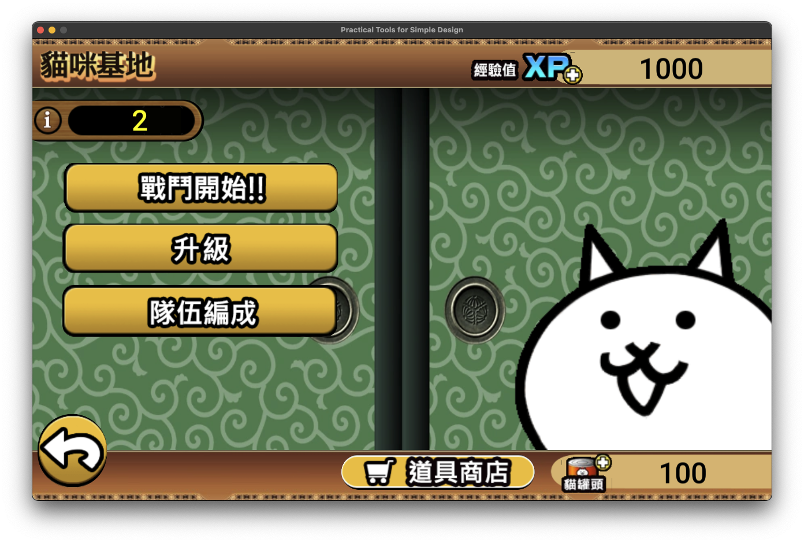
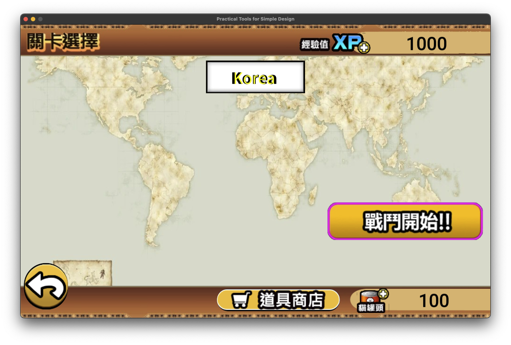
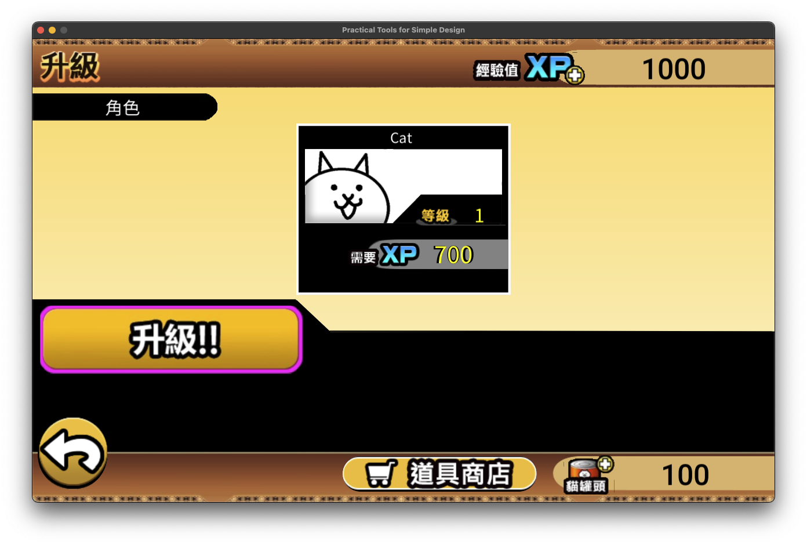
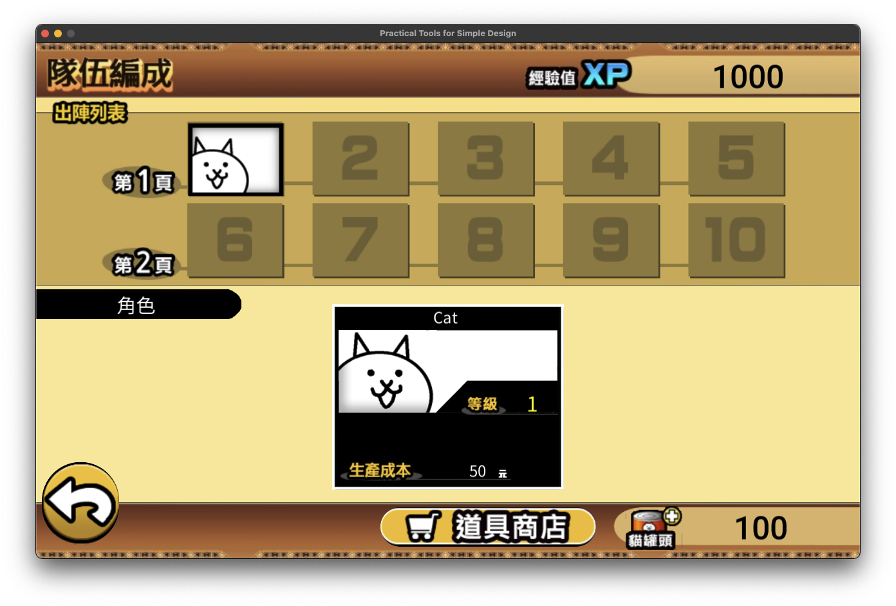
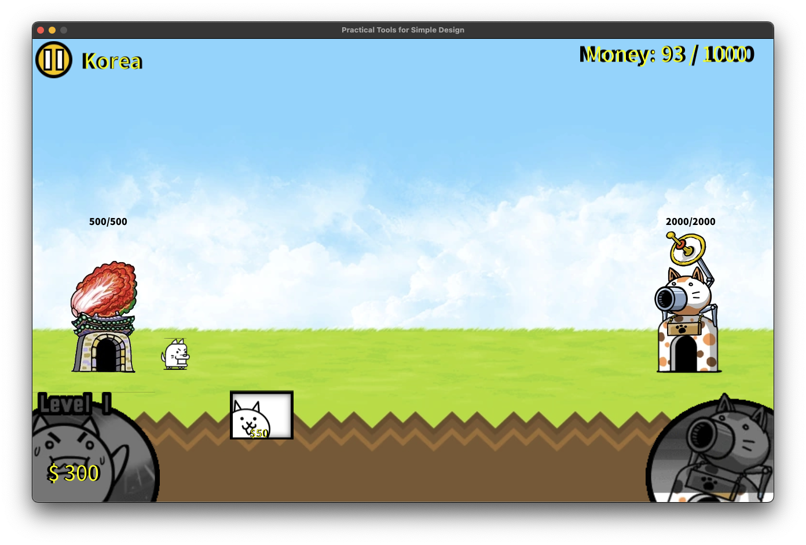
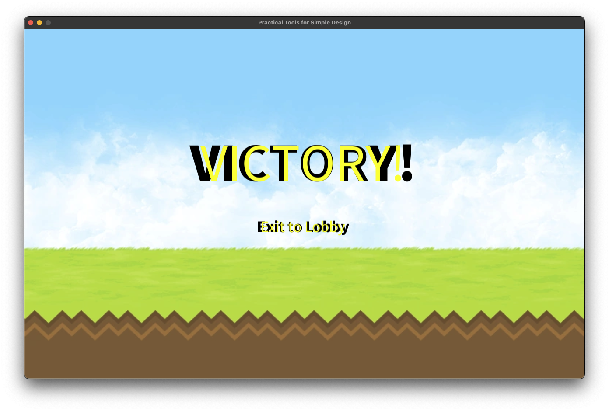
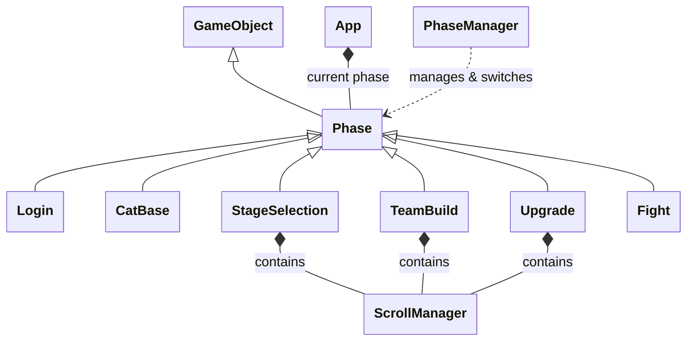
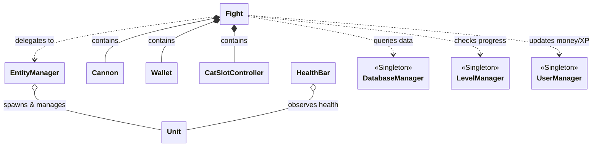

# 2026 OOPL Final Report

## 組別資訊
- 組別：58
- 組員：113590045 林秉峰(Kaze-Lin)、113590052 鄭源勳(Build428)
- 復刻遊戲：貓咪大戰爭

## 專案簡介
### 遊戲簡介
  - 《貓咪大戰爭》是一款操作直覺的橫向塔防遊戲。玩家的核心目標是死守左方的我方基地，並派出貓咪大軍摧毀右方的敵方主堡。
  - 戰鬥時，金錢會隨時間自動累積，玩家可花費金錢升級「工作狂貓」來加快賺錢速度與提升錢包上限。只要資金足夠，點擊圖示即可召喚貓咪。出擊的貓咪會自動前進、攻擊敵人，無須進行任何走位等複雜操作。
  - 若遭遇敵方大軍壓境，可利用右下角自動充能的「貓咪砲」，抓準時機發射雷射來造成傷害並強制擊退敵人，藉此逆轉戰局。成功通關後會獲得經驗值（XP），玩家可用來升級貓咪、解鎖奇特的進化型態，或是強化基礎設施，為後續關卡做準備。

### 組別分工
  - 林秉峰
    - UI
    - 畫面事件觸發
    - 資料、邏輯引用
    - 素材裁切、加工
    - 影片拍攝
    - 期末專案報告
  - 鄭源勳
    - JSON資料撰寫、讀取
    - 抓取素材
    - 角色召喚
    - 攻擊、升級邏輯

## 遊戲介紹
### 遊戲規則
- **遊戲操作**
  - `Admin` 帳號
    - `Account`: admin
    - `Password`: -1
  - **大部分操作皆使用滑鼠操作**
  - `戰鬥`階段的作弊模式
    - D - 遊戲速度五倍速
    - A - 遊戲速度一倍速
    - X - 派出我方貓貓
    - Z - 派出敵方狗勾 - 如果覺得關卡太簡單可以給自己增加難度(?)
- **戰鬥系統**
  - **資源管理**：戰鬥中錢包會隨時間自動累積金錢（Money），玩家可以消耗金錢來升級工作貓（Wallet Upgrade），藉此提高金錢累積速度與金錢上限。
  - **出兵機制**：畫面下方有貓咪陣容按鈕，當金錢足夠且貓咪冷卻完畢時，點擊即可消耗金錢召喚貓咪。
  - **貓咪大砲**：戰鬥過程中大砲會隨時間充能，集滿後可點擊發射，對敵方造成全畫面範圍傷害與擊退效果。
  - **勝負條件**：我方貓咪主堡與敵方主堡各自擁有血量，只要優先將敵方主堡摧毀即獲勝；反之若我方主堡血量歸零則戰鬥失敗。
  - **戰鬥判定**：每隻單位都有攻擊前搖（Precast）、後搖（Postcast）、攻擊間隔（Cooldown）與射程。當敵人進入射程後，單位會停下進行攻擊前搖，前搖結束當下進行傷害判定。
- **貓咪基地與升級系統**
  - 玩家可以在除了`戰鬥`之外的階段看到當前持有的 XP 與貓罐頭。
  - 進入`升級`介面可消耗 XP 升級解鎖的貓咪，或是升級主堡血量、工作貓效率、大砲攻擊力等科技。
  - 進入`隊伍編成`介面可以藉由拖曳或是點擊的方式，將你所擁有的貓咪編排進 10 格的出戰陣容當中。
- **關卡系統**
  - 遊戲提供多個章節與關卡供玩家挑戰。會依據玩家的破關進度解鎖下一關。關卡會根據設計好的時間軸與觸發條件（如敵方主堡血量）來生成不同的敵人與 Boss。

### 遊戲畫面
|   階段   |                        遊戲畫面                        |
|:------:|:--------------------------------------------------:|
| 輸入帳號密碼 |    |
| 歡迎（點擊 continue 以開始遊玩） |    |
|  貓咪基地  |  |
|  關卡選擇  |    |
|   升級   |    |
| 隊伍編成介面 |    |
|   戰鬥   |    |
|  結算畫面  |    |

## 程式設計
### 程式架構
  #### 1. 基礎物件與 UI 系統 (Core & UI System)
  ```mermaid
  %%{init: {"class": {"hideEmptyMembersBox": true}}}%%
  classDiagram
      %% Core & UI Components
      class IStateful {
          <<Interface>>
      }

      GameObject <|-- BackgroundImage
      GameObject <|-- Button
      GameObject <|-- HealthBar
      GameObject <|-- ResourceDisplay
      GameObject <|-- ScrollContainer
      GameObject <|-- Text
      GameObject <|-- TwoLayerText
      
      BackgroundImage <|-- OptionBlock
      OptionBlock <|-- DeployBlock
      OptionBlock <|-- StageBlock
      OptionBlock <|-- UpgradeBlock
      
      TwoLayerText <|-- TextButton

      IStateful <|.. Button
      IStateful <|.. HealthBar
      IStateful <|.. ResourceDisplay
      IStateful <|.. TextButton
  ```
- `GameObject`：所有遊戲物件與介面的最底層基礎類別，提供渲染與更新的基本介面。
- **UI 與 Component 組件**：
  - `Button`、`TextButton`：實現狀態介面（`IStateful`），處理按鈕的 Hover、PressDown 等互動行為。
  - `TwoLayerText`：實作帶有外框效果的雙層文字組件。
  - 各種 `OptionBlock`：應用於不同選單中的選項區塊元件。
  - `HealthBar`、`ResourceDisplay`：呈現單位血量與遊戲資源。

#### 2. 遊戲場景與流程管理 (Phase & State Management)

- `App`：主程式進入點，控制 `START`、`UPDATE`、`END` 的基本狀態迴圈，並負責管理當前的遊戲場景（Phase）。
- `PhaseManager`（Singleton）：負責遊戲場景的切換與歷史路徑堆疊記憶（用於返回上一頁）。
- **Phase 場景系統**：皆繼承自 `GameObject`，作為各個獨立畫面的容器。
  - `Phase`：基礎場景類別。
  - `Login`：登入與註冊畫面。
  - `CatBase`：貓咪大廳，遊戲選單的中樞。
  - `StageSelection`, `Upgrade`, `TeamBuild`：分別負責關卡選擇、貓咪與科技升級，以及支援拖曳換位的隊伍編成。
- `ScrollManager`：泛型的滑動管理器，被多個場景包含，負責處理選單的拖曳滾動與自動吸附（Snap）功能。

#### 3. 戰鬥系統與資料管理 (Combat & Data Management)

- `Fight`：核心戰鬥場景，負責整合介面（如金錢 UI `Wallet`、大砲充能 UI `Cannon`、出兵按鈕 `CatSlotController`）與底層邏輯。
- **Entity 實體系統**：
  - `EntityManager`：戰鬥時專用的實體管理器。負責動態生成我方貓咪、敵方單位以及雙方主堡，並負責處理單位的死亡回收、碰撞偵測以及攻擊範圍篩選。
  - `Unit`：戰場上的戰鬥單位。內部擁有狀態機來控制（Walk, Precast, Postcast, Cooldown, Knockback, Dead），並處理動畫對齊與血量邏輯。
- **資料管理類別（Singleton 單例模式）**：
  - `DatabaseManager`：讀取並管理唯讀的遊戲靜態數據，如 `UnitData`（貓咪數值）、`EnemyData`（敵人數值）、`StageData`（關卡出怪規則）。
  - `UserManager`：處理玩家帳號系統，管理與儲存資源（XP/罐頭）、貓咪等級與解鎖進度、隊伍編成等資料。
  - `LevelManager`：載入並管理當前關卡的時間軸與出怪規則。

### 程式技術
- **場景管理 (Phase Management)**
  - 利用字串對應（`std::unordered_map`）與 Factory 模式來動態生成場景，並用 `std::vector<std::string>` 紀錄玩家進入的路徑，輕鬆實現「Go Back（返回上一頁）」的功能，不需要將所有場景同時保留在記憶體中。
- **JSON 資料驅動 (Data-Driven Design)**
  - 大量使用 `nlohmann::json` 解析遊戲基礎數據。貓咪的血量、攻擊、前後搖時間，以及關卡的出怪間隔等，都可以脫離程式碼直接修改 JSON 檔，讓遊戲的數值平衡調整非常方便。存檔系統也依靠 JSON 將複雜的使用者結構（`UserProfile`）序列化儲存。
- **戰鬥有限狀態機 (Finite State Machine)**
  - `Unit` 內部實作了嚴謹的狀態機切換（`UnitState`）。單位遭遇敵人時切換至 `Precast` 並開始前搖計時，前搖結束的當下才會扣除敵人血量，隨後進入 `Postcast` 與 `Cooldown`。徹底解決了「動作還沒播放完就先扣血」的邏輯與動畫分離問題。
- **UI 互動與拖曳機制**
  - 在編成介面中實作了 Drag & Drop 機制。利用滑鼠按下的時間與座標差距來區分玩家是想要「滑動畫面（Scroll）」還是「拖拉物件（Drag）」。當判定為拖拉時，會生成半透明的跟隨虛影（Ghost），並在放開時計算最靠近的格子（Grid Index）進行陣容抽換。
- **事件回調與解耦 (Observer / Callback Pattern)**
  - 大量利用 `std::function` 將 UI 更新邏輯與底層數值解耦。例如戰鬥中的 `Unit` 血量變化會觸發 `m_onHealthChanged` 通知血條更新；`Wallet` 餘額改變會通知 UI 更新文字，避免每幀在 UI 層輪詢變數。

### 使用到 AI/AI Agent 的部分
- 我們在對於完全沒碰過的東西或是不熟悉的架構或語法我們都會與使用 AI 來作為輔助查詢，像是 `JSON` 檔案的讀取與寫入、遊戲階段的返回功能、單例模式以及一些 `Manager` ，都是透過與 AI 的討論、學習。
- 在開發的時候我們也會使用 AI Agent 幫助我們找到可能在設定邊界條件有誤的部分，以及在程式架構上提供給我們一些最佳化的建議。

## 結語
### 問題與解決方法
- **問題一：介面拖曳（Drag）與畫面滾動（Scroll）的判定衝突**
  - **描述**：在貓咪編成畫面中，背景選單可以橫向滑動，但個別貓咪圖示又需要支援拖曳放入隊伍中。若判定條件太寬鬆，玩家點擊滑動時很容易誤觸發貓咪拖曳事件。
  - **解決方法**：引入了「按壓時間」與「移動閥值」雙重判定。當滑鼠按下後若位移超過一定像素，或停留超過特定毫秒後再移動，才會將狀態切換為生成「拖曳虛影（Drag Ghost）」；若是快速短暫的橫向位移，則全部交由 `ScrollManager` 處理滾動邏輯。
- **問題二：大量實體在範圍判定時的效能浪費**
  - **描述**：遊戲後期場上可能同時存在數十隻貓咪與敵人。若每隻單位在攻擊時都透過雙層迴圈掃描全場尋找可攻擊對象，會造成嚴重的效能浪費。
  - **解決方法**：將場上單位統一交由 `EntityManager` 集中管理。當單位攻擊時，只需呼叫 `GetEntitiesInRange(faction, startX, endX)`。管理器可以根據陣營與 X 座標進行高效率的篩選並回傳目標陣列，讓單位能輕易實現單體打第一隻，或範圍攻擊打全部的邏輯。
- **問題三：單位攻擊與動畫不同步**
  - **描述**：一開始設計攻擊邏輯時，冷卻一到就直接扣除敵方血量，導致貓咪的「揮擊動畫」才剛開始，敵人就已經受傷或死亡，視覺非常突兀。
  - **解決方法**：在 `Unit` 中建立時間軸計時器與多重狀態（Precast / Postcast）。讓單位的攻擊邏輯拆分為「準備攻擊（等待前搖）」和「造成傷害（前搖結束的那一幀）」兩階段，才順利讓動畫與實際判定完美貼合。

### 自評
| 項次 | 項目                      | 完成 |
|:--:|-------------------------|:--:|
| 1  | 完成專案權限改為 public         | V  |
| 2  | 具有 debug mode 的功能       | V  |
| 3  | 解決專案上所有 Memory Leak 的問題 | V  |
| 4  | 報告中沒有任何錯字，以及沒有任何一項遺漏    | V  |
| 5  | 報告至少保持基本的美感，人類可讀        | V  |

### 心得
#### **113590045 林秉峰**  
  &nbsp;&nbsp;&nbsp;&nbsp;這是我第一次與別人共同合作開發一個專案，在過程中難免有一些摩擦，所幸到最後都有圓滿解決。貓咪大戰爭這個遊戲的遊玩方式並不複雜，但如果要完美復刻的話肯定會做不完，所以我和我的隊友經過了長時間的討論後確定我們的目標，刪減掉了一些原版既有的功能，才讓這個專案得以進行下去。<br>
  
  &nbsp;&nbsp;&nbsp;&nbsp;在復刻這個遊戲的時候我們時常會遇到一些溝通上的問題，我向我的隊友說我們現在需要哪些功能，到了我需要使用那些功能的時候隊友卻說還沒做，這個溝通上的問題拖慢了整體專案的發展進度，所以後來我改變了提出需求的方式，用提出具體時間的方式讓隊友可以明確的知道什麼時間點會需要完成什麼功能，避免了語句上的誤會。<br>
  
  &nbsp;&nbsp;&nbsp;&nbsp;在復刻這個遊戲最開心的就是把一些功能做出來的時候，像是我在做遊戲階段時，我遇到了返回上一頁卻不會回到真正的上一頁的問題， A -> B -> D ， A -> C -> D ，這兩個路徑如果在 D 想要回到上一頁的只能跳回原本寫死的上一個分頁，所以我考慮到可能需要用到類似堆疊的方式來處理這個問題，所以我拿這個問題去請教同學邱冠勛，他幫我對這個問題的解法做了非常詳細的說明，並且在後來成功地做出 `PhaseManager` 來處理頁面跳轉的問題。<br>

  &nbsp;&nbsp;&nbsp;&nbsp;回顧整個開發歷程，雖然我們捨棄了部分原版功能，也曾經歷過溝通上的陣痛期，但正是這些挑戰促使我們找到更有效率的合作模式。看著 `PhaseManager` 成功運作的那一刻，所有的辛苦都轉化成了滿滿的成就感。這次的初體驗讓我明白，一個專案的成功不僅仰賴程式邏輯的推演，更需要明確的排程管理以及勇於向外尋求資源的心態。這次的合作不僅是一次難忘的實戰演練，也為我未來的程式開發打下了更堅實的基礎。
  
  <br>

#### **113590052 鄭源勳**
  

### 貢獻比例
|      組員       | 貢獻度  |
|:-------------:|:----:|
| 113590045 林秉峰 | 50% |
| 113590052 鄭源勳 | 50% |