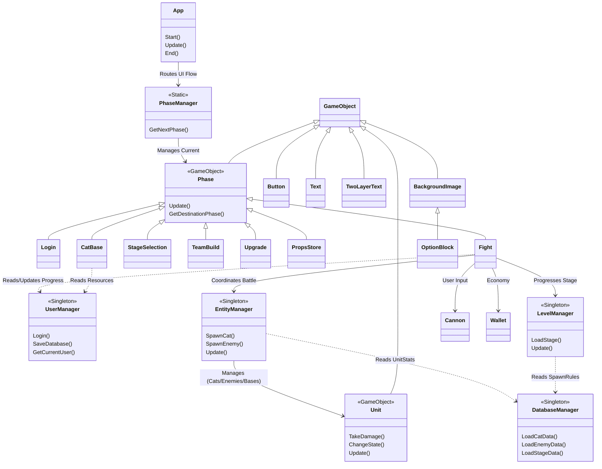

# PTSD Template

This is a [PTSD](https://github.com/ntut-open-source-club/practical-tools-for-simple-design) framework template for students taking OOPL2024s.

## Quick Start

1. Use this template to create a new repository
   

2. Clone your repository

   ```bash
   git clone YOUR_GIT_URL --recursive
   ```

3. Build your project

  > [!WARNING]
  > Please build your project in `Debug` because our `Release` path is broken D:
   
   ```sh
   cmake -DCMAKE_BUILD_TYPE=Debug -B build # -G Ninja
   ```
   better read [PTSD README](https://github.com/ntut-open-source-club/practical-tools-for-simple-design)

## Project Architecture

Based on the `include/` and `src/` directories, here is the high-level architecture of The Battle Cats clone:



# 2026 OOPL Final Report

## 組別資訊

組別：
組員：
復刻遊戲：

## 專案簡介

### 遊戲簡介
### 組別分工

## 遊戲介紹

### 遊戲規則
### 遊戲畫面

## 程式設計

### 程式架構
### 程式技術
### 使用到 AI/AI Agent 的部分 (沒有用到者，不需要寫這篇)

## 結語

### 問題與解決方法


### 自評

| 項次 | 項目                   | 完成 |
|------|------------------------|-------|
| 1    | 這是範例 |  V  |
| 2    | 完成專案權限改為 public |  V  |
| 3    | 具有 debug mode 的功能  |  V  |
| 4    | 解決專案上所有 Memory Leak 的問題  |  ?  |
| 5    | 報告中沒有任何錯字，以及沒有任何一項遺漏  |  ?  |
| 6    | 報告至少保持基本的美感，人類可讀  |  ?  |

### 心得
呵呵呵

### 貢獻比例
| 人員 | 貢獻度 |
|------|------|
| 林秉峰 | 0% |
| 鄭源勳 | 0% |
| Gemini|100%|